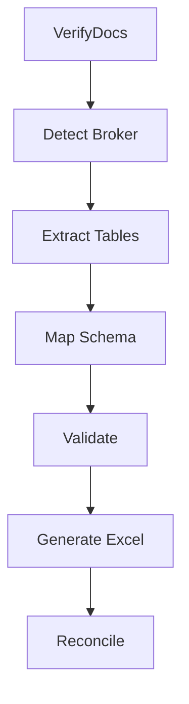

# Brokerage Reconciliation – Output Design & Backend Implementation

---

# 1. Final Output Excel Design

This is the primary deliverable for operations teams.

---

## Sheet 1 — Summary

```
Invoice ID: INV123
Broker: Mercury
Currency: USD
Processed At: 2026-01-10

-----------------------------------
Total Trades        : 50
Matched             : 42
Mismatched          : 5
New Trades          : 3
Missing Trades      : 2
-----------------------------------

Broker Total        : 125,000
MS Total            : 124,800
Difference          : 200
-----------------------------------
```

---

## Sheet 2 — Reconciliation_Details

Columns:

```
Trade ID
Trade Date
Client Account
Direction

Quantity (Broker)
Quantity (MS)

Price (Broker)
Price (MS)

Brokerage (Broker)
Brokerage (MS)
Brokerage (Calculated)

Currency

Status
Mismatch Reason
Confidence Score
```

---

## Status Values

```
MATCH
MISMATCH
NEW
MISSING
```

---

## Mismatch Reasons

```
MISMATCH_QTY
MISMATCH_PRICE
MISMATCH_BROKERAGE
MULTIPLE_ISSUES
```

---

## Confidence Score Logic

```
trade_id match → +1
qty match      → +1
price match    → +1
brokerage      → +1

Max = 4
```

---

## Sheet 3 — New_Trades

Contains trades present in broker but not in MS data.

---

## Sheet 4 — Missing_Trades

Contains trades present in MS but not in broker data.

---

## Sheet 5 — Raw_Extracted_Data

Contains raw normalized data from extraction for debugging.

---

# 2. Backend Architecture

## Folder Structure

```
backend/
│
├── app/
│   ├── main.py
│   │
│   ├── api/
│   │   ├── routes/
│   │   │   ├── upload.py
│   │   │   ├── extract.py
│   │   │   ├── reconcile.py
│   │   │   └── download.py
│   │
│   ├── services/
│   │   ├── verification_service.py
│   │   ├── extraction_service.py
│   │   ├── mapping_service.py
│   │   ├── validation_service.py
│   │   ├── reconciliation_service.py
│   │   └── excel_service.py
│   │
│   ├── agents/
│   │   ├── graph.py
│   │   ├── nodes/
│   │   │   ├── verify_node.py
│   │   │   ├── detect_broker_node.py
│   │   │   ├── extract_node.py
│   │   │   ├── map_node.py
│   │   │   ├── validate_node.py
│   │   │   ├── excel_node.py
│   │   │   └── reconcile_node.py
│   │
│   ├── core/
│   │   ├── config.py
│   │   ├── logger.py
│   │
│   ├── utils/
│   │   ├── pdf_utils.py
│   │   ├── mapping_utils.py
│   │   ├── reconciliation_utils.py
│   │
│   ├── models/
│   │   ├── schemas.py
│   │
│   ├── data/
│   │   ├── broker_registry.json
│   │
│   └── storage/
│       ├── uploads/
│       ├── outputs/
│
└── requirements.txt
```

---

# 3. FastAPI Entry

```python
from fastapi import FastAPI
from app.api.routes import upload, extract, reconcile, download

app = FastAPI()

app.include_router(upload.router)
app.include_router(extract.router)
app.include_router(reconcile.router)
app.include_router(download.router)
```

---

# 4. API Endpoints

## Upload

```
POST /upload
```

---

## Extract

```
POST /extract
```

---

## Reconcile

```
POST /reconcile
```

---

## Download

```
GET /download/{file_id}
```

---

# 5. LangGraph Agent Flow

## Nodes

- verify_docs_node
- detect_broker_node
- extract_table_node
- map_schema_node
- validate_node
- generate_excel_node
- reconcile_node

---

## Flow



---

# 6. Reconciliation Core Logic

```python
import pandas as pd


def reconcile(broker_df, ms_df):

    merged = broker_df.merge(
        ms_df,
        on="trade_id",
        how="left",
        suffixes=("_broker", "_ms")
    )

    merged["price_match"] = abs(
        merged["price_broker"] - merged["price_ms"]
    ) <= 0.01

    merged["qty_match"] = (
        merged["quantity_broker"] == merged["quantity_ms"]
    )

    merged["brokerage_calc"] = (
        merged["price_broker"] *
        merged["quantity_broker"] *
        merged["commission_rate"]
    )

    merged["brokerage_match"] = abs(
        merged["brokerage_calc"] - merged["brokerage_broker"]
    ) <= 1

    merged["status"] = merged.apply(assign_status, axis=1)

    return merged
```

---

# 7. Status Assignment

```python
import pandas as pd


def assign_status(row):

    if pd.isna(row["trade_id_ms"]):
        return "NEW"

    if row["qty_match"] and row["price_match"] and row["brokerage_match"]:
        return "MATCH"

    return "MISMATCH"
```

---

# 8. Final System Flow

```
UPLOAD
  ↓
VERIFY
  ↓
EXTRACT + MAP
  ↓
CANONICAL EXCEL
  ↓
RECONCILE
  ↓
FINAL EXCEL
```

---

# Summary

This document defines:

- Final Excel output format used by operations
- Backend architecture and folder structure
- API endpoints
- Agentic workflow using LangGraph
- Deterministic reconciliation logic

This is a **POC-ready, buildable system design**.

