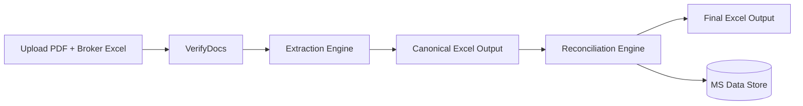
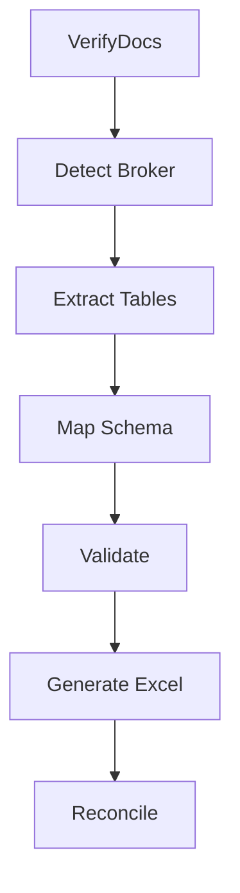

# Brokerage Invoice Reconciliation – POC Architecture (UPDATED FLOW)

## Core Correction (Important)

Previous assumption was wrong.

👉 PDF vs Excel upload = **ONLY verification** (sanity check)
👉 Actual reconciliation = happens later against **MS client data**

So system is now split into **2 distinct stages**:

---

# FINAL POC FLOW (CORRECT)

```
Upload (PDF + Broker Excel)
        │
        ▼
Step 1: Verification (light check)
        │
        ▼
Step 2: Extraction → Canonical Excel
        │
        ▼
User downloads normalized Excel
        │
        ▼
Step 3: Reconciliation vs MS Client Data
```

---

# Stage 1 — Verification (NOT reconciliation)

Purpose:

Just ensure user didn’t upload wrong files.

Checks:

- invoice number matches
- broker name matches
- currency matches
- rough totals match (± tolerance)

❌ No trade-level matching
❌ No reconciliation logic

Output:

```
verification_status = PASS / FAIL
```

---

# Stage 2 — Extraction Engine

Goal:

Convert messy broker invoice → clean structured Excel

This is the **core value of POC**.

---

## Extracted Fields (Based on Your Mapping)

### MS Internal Fields (Target Schema)

```
Direction
Trade Date
Trade ID
Price
Broker Code
Client Account
Quantity
Currency
Brokerage
```

---

### Broker Invoice Variations (What we will map)

```
Buy / Sell / B / S → Direction
Rate / Price → Price
Broker Name / ID → Broker Code
Client Name / ID → Client Account
Volume / Quantity / Watt → Quantity
Currency / CCY → Currency
Commission → Brokerage
```

---

## Canonical Schema (FINAL)

```json
{
  "direction": "",
  "trade_date": "",
  "trade_id": "",
  "price": "",
  "broker_code": "",
  "client_account": "",
  "quantity": "",
  "currency": "",
  "brokerage": ""
}
```

---

# Stage 2 Pipeline

```
PDF → Table Extraction → Column Mapping → Canonical Schema → Excel Output
```

---

# Stage 3 — Reconciliation Engine (NEW LOGIC)

Now the real problem.

👉 Compare extracted trades (Broker data)
👉 Against MS Client Data (large dataset)

---

## Key Constraint

Client dataset can be:

```
10K – 1L+ rows
```

So design must be:

- indexed
- fast lookup
- not row-by-row brute force

---

# Matching Strategy (Deterministic)

You DO NOT rely on LLM here.

---

## Primary Match Keys

```
Trade ID (if exists)
ELSE
Trade Date + Client + Quantity + Price
```

---

## Matching Levels

### Level 1 — Exact Match

```
trade_id matches
```

→ strongest

---

### Level 2 — Composite Match

```
trade_date + client + quantity + price
```

---

### Level 3 — Fuzzy Match (POC optional)

Used if small differences exist.

---

# Brokerage Validation Logic (CRITICAL)

Client gave formula:

```
brokerage = price × quantity × commission%
```

System should:

1. Extract brokerage from invoice
2. Recalculate using MS data
3. Compare

Output:

```
brokerage_match = TRUE / FALSE
```

---

# Reconciliation Outcomes

For each trade:

### 1 MATCHED

```
exists in MS
values match
```

---

### 2 MISMATCH

```
exists but values differ
```

---

### 3 NEW ENTRY

```
exists in broker
not in MS
```

---

### 4 MISSING

```
exists in MS
not in broker
```

---

# Output Format (FINAL)

Excel will contain:

```
Trade ID
Trade Date
Client
Quantity
Price
Brokerage (Broker)
Brokerage (MS)
Status
```

---

# Data Processing Strategy (IMPORTANT)

## For POC

Use:

- pandas
- load MS Excel into memory

---

## For Production

Use:

- SQLite / Postgres
- index on:

```
trade_id
trade_date
client
```

---

# Updated Agent Flow

## Agent 1 — VerifyDocs

(light only)

---

## Agent 2 — ExtractTables

(pdfplumber + camelot)

---

## Agent 3 — SchemaMapper

(map broker → canonical)

---

## Agent 4 — ExcelGenerator

(output normalized file)

---

## Agent 5 — Reconciliation Agent

(compare vs MS data)

---

# End-to-End Flow


---

# Data Transformation Example

## Input (Broker)

```
Date | Ref | Qty | Px | Comm
```

---

## After Mapping

```
trade_date | trade_id | quantity | price | brokerage
```

---

## After Reconciliation

```
trade_id | broker_qty | ms_qty | status
```

---

# What Changed vs Previous Design

### Before

- PDF vs Excel = reconciliation

### Now

- PDF vs Excel = validation only
- Reconciliation = separate stage vs MS data

---

# Why This Design Is Correct

- mirrors actual analyst workflow
- separates concerns cleanly
- reduces system complexity
- allows independent scaling of reconciliation

---

# POC Scope (REALISTIC)

- 6–7 brokers
- 1 sample per broker
- 50 MS rows (test)
- pandas-based reconciliation

---

# Scaling Plan

Later:

- move MS data to DB
- indexing
- batch reconciliation

---

# Final Reality Check

Your system is:

```
Extraction + Normalization + Deterministic Reconciliation
```

---

# Reconciliation Rule Engine (Field-Level Logic)

This is the most critical part of correctness.

## Matching Keys Priority

1. trade_id (exact match)
2. else composite key:

```
trade_date + client_account + quantity + price
```

---

## Field Comparison Rules

### Quantity

```
exact match required
```

POC tolerance:

```
±0 (strict)
```

---

### Price

Floating precision issue expected

Rule:

```
abs(broker_price - ms_price) <= 0.01
```

---

### Brokerage

Compute using:

```
brokerage_calc = price × quantity × commission_rate
```

Compare:

```
abs(brokerage_calc - broker_value) <= tolerance
```

Tolerance:

```
<= 1 unit (currency dependent)
```

---

### Currency

```
must match (POC)
```

---

### Direction

Map:

```
Buy/B → BUY
Sell/S → SELL
```

---

## Final Status Logic

```
IF all fields match → MATCH
IF exists but values differ → MISMATCH
IF not found in MS → NEW
IF exists in MS not in broker → MISSING
```

---

# Pandas-Based Reconciliation (POC Implementation)

## Step 1 Load Data

```python
import pandas as pd

broker_df = pd.read_excel("broker_output.xlsx")
ms_df = pd.read_excel("ms_data.xlsx")
```

---

## Step 2 Normalize Columns

```python
broker_df.columns = broker_df.columns.str.lower()
ms_df.columns = ms_df.columns.str.lower()
```

---

## Step 3 Primary Join (Trade ID)

```python
merged = broker_df.merge(
    ms_df,
    on="trade_id",
    how="left",
    suffixes=("_broker", "_ms")
)
```

---

## Step 4 Secondary Join (Fallback)

```python
fallback = broker_df.merge(
    ms_df,
    on=["trade_date", "client_account", "quantity", "price"],
    how="left"
)
```

---

## Step 5 Brokerage Validation

```python
merged["calc_brokerage"] = (
    merged["price_broker"] * merged["quantity_broker"] * merged["commission_rate"]
)

merged["brokerage_match"] = (
    abs(merged["calc_brokerage"] - merged["brokerage_broker"]) < 1
)
```

---

## Step 6 Status Assignment

```python
conditions = [
    merged["trade_id_ms"].notna() & merged["brokerage_match"],
    merged["trade_id_ms"].notna(),
    merged["trade_id_ms"].isna()
]

choices = ["MATCH", "MISMATCH", "NEW"]

merged["status"] = np.select(conditions, choices)
```

---

# Final HLD (Updated with Reconciliation Split)



---

# Final LLD (System Components)

## Backend: FastAPI

Modules:

- upload_service
- extraction_service
- mapping_service
- validation_service
- reconciliation_service

---

## Agent Orchestration (LangGraph)

Graph:

```
Verify → Extract → Map → Validate → Output → Reconcile
```

---

## LLM Usage

Used ONLY for:

- column mapping
- broker detection

NOT used for:

- reconciliation
- calculations

---

# API Design

## Upload

```
POST /upload
```

Response:

```
upload_id
```

---

## Verify

```
POST /verify
```

---

## Extract

```
POST /extract
```

Output:

```
canonical_excel_path
```

---

## Reconcile

```
POST /reconcile
```

Input:

```
canonical_excel + ms_data
```

Output:

```
reconciliation_result
```

---

## Download

```
GET /download/{file_id}
```

---

# Agentic Flow (LangGraph Nodes)

## Nodes

- verify_docs_node
- detect_broker_node
- extract_table_node
- map_schema_node
- validate_node
- generate_excel_node
- reconcile_node

---

## Flow



---

# Performance Considerations

POC:

- pandas merge (O(n log n))

Production:

- indexed DB joins

---

# Final Implementation Stack

- FastAPI → API layer
- LangGraph → orchestration
- OpenAI/Claude → mapping only
- pandas → reconciliation engine
- MongoDB → metadata
- SQLite/Postgres → MS data (future)

---

# Final System Summary

You are building:

```
Broker Invoice Normalization Engine
+
Deterministic Reconciliation Engine
```

NOT:

```
AI decision system
```

That distinction is what will make this system reliable.

---

